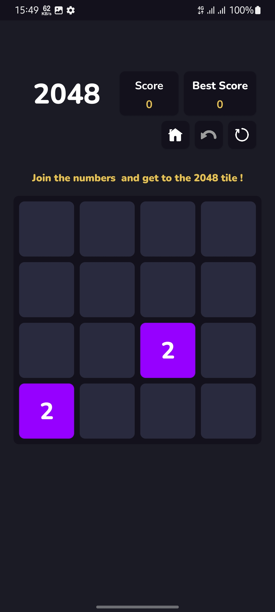

# 2048 Game
Bu klassik 2048 o‘yinining mobil ilova versiyasi. Foydalanuvchilar raqamlarni birlashtirib, 2048 raqamiga yetishga harakat qilishadi.

## Ilova haqida
2048 Game — bu oddiy, ammo qiziqarli o‘yin bo‘lib, unda foydalanuvchilar plitkalar harakatlantirib raqamlarni qo‘shadi. O‘yin [Kotlin/Java/Swift yoki qaysi tilda yozgan bo‘lsangiz] da yozilgan va [MVVM/MVC yoki boshqa arxitektura] arxitekturasidan foydalanadi.

## Skrinshotlar
Quyida ilovaning asosiy sahifalari keltirilgan:
|             Home Screen              |                Game Initial State                |          Game Full State           |
|--------------------------------------|--------------------------------------------------|------------------------------------|
|  |  |  |

|             Home Screen              |                Game Initial State                |          Game Full State           |
|--------------------------------------|--------------------------------------------------|------------------------------------|
|  |  |  |

## Xususiyatlari
- Oddiy va qulay interfeys
- O‘yin statistikasini ko‘rish imkoniyati
- Moslashuvchan dizayn

## APK versiyasi
So‘nggi APK fayli: [bu yerga link qo‘ying](#)  
Versiya: v1.0.0

## O‘rnatish
1. APK faylini yuklab oling.
2. Qurilmangizda "Noma'lum manbalardan o‘rnatish" ni yoqing.
3. Faylni ochib o‘rnating.
